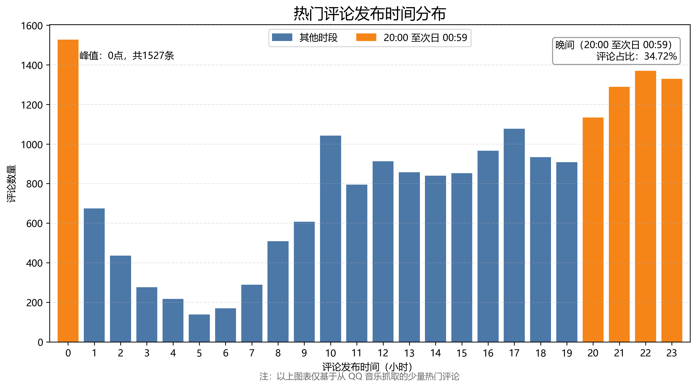
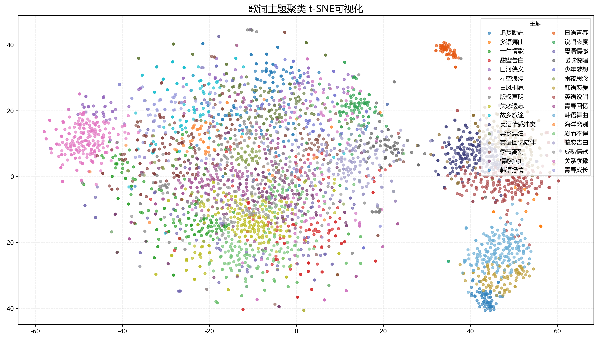

# QQ 音乐样本数据分析报告

> 姓名：高子淇
> 学号：2025010481 
> 班级：计54 

## 结论概述与数据范围

本报告从项目爬取的 QQ 音乐歌曲、歌词和热门评论数据出发，完成三项分析：

1. 使用常规柱状图分析热门评论的发布时间分布；
2. 使用词云和标准化词频比较歌词与热门评论的语言重心；
3. 使用预训练文本向量、K-Means 和 t-SNE 分析歌词语义聚类，并列出各簇主题和典型歌曲。

原始数据文件为 `data/raw/song_list.json`，共包含 3835 首歌曲和 19151 条热门评论。由于这些数据是爬虫从平台中取得的部分数据，而且每首歌曲只保存了少量热门评论，报告中的结论只对本次样本负责，不能直接推广为 QQ 音乐全部歌曲或全部用户的规律。

三项分析采用的有效数据量不同：

| 分析项目 | 有效数据 | 被过滤数据 | 过滤原因 |
| --- | ---: | ---: | --- |
| 评论发布时间 | 19151 条评论 | 0 条 | 评论正文非空，且小时字段为 0 至 23 |
| 歌词词云 | 3821 首歌词 | 14 首 | 清洗或分词后没有有效词语 |
| 评论词云 | 19140 条评论 | 11 条 | 分词后没有有效词语 |
| 歌词语义聚类 | 3789 首歌词 | 46 首 | 清洗后少于 30 字符，或没有有效分词 |

歌词词云与歌词聚类的有效歌曲数不同，是因为聚类额外设置了 30 字符的最短歌词要求，并非数据统计错误。

## 公共数据处理

 `analysis/utils` 为`analysis/`下的公共处理模块，包括：
 - `load_from_json_dict(file: Path) -> list[dict]` 负责读取内容为 dict 的 JSON 文件
 - `save_to_json(file: Path, content: dict | list) -> None` 负责存储数据到 JSON 文件
 - `load_stopwords() -> set[str]` 负责加载停用词
 - `clean_lyrics(lyrics: list[str]) -> str` 负责清洗歌词，去除空行、带制作信息标记的行以及同一首歌曲中完全重复的歌词行
 - `tokenize(text: str, stopwords: set[str]) -> list[str]` 负责分词，先统一空白和标点，再使用 `jieba` 分词，并删除停用词、纯符号、纯数字和无意义的单字符外文片段

歌词清洗和分词的核心实现如下：

```python
def clean_lyrics(lyrics: list[str]) -> str:
    valid_lines = []
    seen_lines = set()
    for line in lyrics:
        line = line.strip()
        if line == "" or "：" in line or " - " in line or line in seen_lines:
            continue
        valid_lines.append(line)
        seen_lines.add(line)
    return "\n".join(valid_lines)

def tokenize(text: str, stopwords: set[str]) -> list[str]:
    text = re.sub(r"\s+", " ", text).lower()
    text = re.sub(r"[，。！？；：、,.!?;:（）()\[\]【】“”‘’…—_/]+", " ", text)
    words = jieba.lcut(text, cut_all=False, HMM=True)
    tokens = []
    for word in words:
        word = word.strip()
        if (not word
                or word in stopwords
                or not any(char.isalnum() for char in word)
                or word.isdigit()
                or (len(word) == 1
                    and not re.fullmatch(r"[\u4e00-\u9fff]", word))):
            continue
        tokens.append(word)
    return tokens
```

歌词词云和歌词聚类复用同一套清洗、停用词和分词规则，从而减少不同分析之间由预处理方式造成的偏差。

## 结论一：热门评论集中在晚间和午夜附近，0 点为单小时峰值

### 分析方法

`analysis/comment_time.py` 遍历每首歌曲的热门评论，检查评论正文和时间字段，将有效评论按发布时间的小时累计到长度为 24 的列表中，并计算该时段的评论数量、占比和单小时峰值。
注：当前代码将 20、21、22、23 和 0 点定义为晚间时段。

相关核心代码如下：

```python
NIGHT_HOURS = {20, 21, 22, 23, 0}
hour_counts = [0] * 24

for song in song_data:
    for comment in song["comments"]:
        if comment["text"].strip() == "":
            continue
        comment_hour = int(comment["time"]["hour"])
        if 0 <= comment_hour <= 23:
            hour_counts[comment_hour] += 1

valid_comment = sum(hour_counts)
night_comment = sum(hour_counts[hour] for hour in NIGHT_HOURS)
night_ratio = night_comment / valid_comment
peak_hour = max(HOURS, key=lambda hour: hour_counts[hour])
```

24 小时的原始数量保存到 `analysis/output/comment_hour/comment_hour_counts.csv`。

热门评论发布时间柱状图中，20 点至次日 0 点使用橙色，其余时段使用蓝色，并在图中标注占比和峰值。

### 数据结果

| 指标 | 结果 |
| --- | ---: |
| 有效热门评论 | 19151 条 |
| 无效评论 | 0 条 |
| 20:00 至次日 00:59 的评论 | 6649 条 |
| 该时段占全部评论比例 | 34.72% |
| 单小时峰值 | 0 点 |
| 0 点评论数 | 1527 条 |

晚间各小时的评论数为：20 点 1134 条、21 点 1289 条、22 点 1370 条、23 点 1329 条、0 点 1527 条。相比之下，凌晨 3 至 7 点的评论数明显较少，其中 5 点仅有 139 条。



### 结论

在本次抓取到的热门评论中，发布时间并非全天均匀分布。20 点以后评论数连续处于较高水平，20:00 至次日 00:59 的五个小时贡献了 34.72% 的评论，0 点又以 1527 条成为单小时峰值。由此可见，样本热门评论更集中在晚间休闲时段和午夜附近。

一个比较合理的解释是，晚上结束学习或工作以后，人们有更多完整的空闲时间，听歌、刷评论和分享感受都更方便。相比白天，晚间的环境也更安静，一些情绪较强的歌曲更容易让听众联想到自己的经历，从而产生评论的想法。0 点附近又正好处在很多人睡前使用手机的时间，因此评论数可能进一步增加。可以说，热门评论的高峰可能不只是“听歌人数多”，还和听众有时间停下来表达情绪、寻找共鸣有关。

## 结论二：歌词偏向作品表达，评论偏向评价与回应

### 分析方法

`analysis/wordcloud_analyse.py` 将歌词和热门评论作为两个独立语料集合。歌词先使用 `utils.clean_lyrics` 清洗，再用 `utils.tokenize` 分词并使用 `Counter` 计数；评论手动去掉空文本后，用 `utils.tokenize` 分词，再使用 `Counter` 计数。由于两类语料的总词数不同，程序除保存原始次数外，还计算每一万词出现次数：

```python
lyrics_counter.update(tokens)
comments_counter.update(tokens)

counter_df = pd.DataFrame(
    counter.most_common(),
    columns=["token", "count"],
)
counter_df["count_per_1w"] = 10_000 * counter_df["count"] / total_tokens
```

歌词词频信息和评论词频信息保存到 `analysis/output/wordcloud` 下。

词云使用各自语料的每万词频率作为权重，左右两幅图使用相同的画布大小和最大词数。

### 语料统计

| 指标 | 歌词语料 | 评论语料 |
| --- | ---: | ---: |
| 有效文本数 | 3821 | 19140 |
| 有效词语总数 | 354361 | 304699 |
| 不同词语数 | 41590 | 41224 |

选取与结论关系较强的词语进行比较：

| 词语 | 歌词每万词频 | 评论每万词频 | 主要差异 |
| --- | ---: | ---: | --- |
| 爱 | 82.57 | 51.13 | 歌词突出作品的核心情感内容 |
| 世界 | 22.41 | 15.79 | 歌词常用于构造叙事空间和意象 |
| 时间 | 16.06 | 11.65 | 歌词常写时间流逝和关系变化 |
| 回忆 | 15.07 | 8.76 | 歌词常进行情感回望 |
| 喜欢 | 8.21 | 62.39 | 评论明显更偏直接表达态度 |
| 好听 | 0.28 | 35.61 | 评论中多用评价用语 |
| 加油 | 0.20 | 6.07 | 评论包含对歌手或其他听众的支持 |
| 青春 | 4.43 | 10.83 | 评论常把歌曲与个人经历联系起来 |
| 故事 | 7.08 | 9.68 | 评论常会讨论联歌曲与背后的故事 |

最终生成的词云图如下：


### 结论

从词频结果可以看出，歌词和热门评论的用词差异比较明显。歌词中的“爱、世界、时间、回忆”等词更突出，更多是在写感情、时间和故事；评论中的“喜欢、好听、加油”等词明显更多，主要是在评价歌曲、表达喜欢或表达支持。“青春”和“故事”在评论中也比较常见，说明听众会把歌曲和自己的经历联系起来。

这种差异和两类文本本身的作用是比较一致的。歌词需要完成歌曲的叙事和情感表达，所以会反复使用爱情、时间、回忆、世界等比较适合展开故事和情绪的词；评论则是听众听完歌曲之后的回应，因此更容易直接出现“喜欢”“好听”这样的态度词，以及“加油”这样的支持性表达。也就是说，评论并不是简单重复歌词中的内容，而是把歌曲转成了听众自己的评价和感受。

另外，值得注意的是，“青春”和“故事”在评论中的频率高于歌词。听众可能会因为一首歌想到以前的经历、某个阶段的人或事情，再把这些回忆写进评论区。从这个角度看，歌曲除了本身的作品表达之外，也可能成为听众回忆个人经历、和其他听众交流情绪的一个入口。

由此可见，这两类文本各有侧重：歌词主要是在表达歌曲本身的内容，评论更多是在评价和回应歌曲，以及表达共鸣。

## 结论三：歌词语义可以形成多个具有明确特征的聚类

### 分析方法

`analysis/lyrics_tsne.py` 执行以下流程：
- 清洗歌词并分词
- 过滤清洗后长度不足 30 字符的歌词，再将长歌词按照原有行顺序切分为最长 300 字符的文本块。程序
- 使用 embedding 模型 `BAAI/bge-small-zh-v1.5` 将每个文本块转化为 512 维向量
- 对同一首歌的文本块向量求平均并再次归一化，最终得到 3789 个歌曲向量。
- K-Means 将 512 维歌曲向量聚成 32 个 cluster
- 每个 cluster 的关键词由 cluster 内分词结果统计得到，典型歌曲则选取距离 K-Means 聚类中心最近的歌曲
- t-SNE 将歌曲向量投影到二维进行可视化

相关核心代码如下：

```python
chunk_embeddings = model.encode(
    all_chunks,
    batch_size=BATCH_SIZE,
    normalize_embeddings=True,
    convert_to_numpy=True,
)

for chunk_embedding, song_idx in zip(chunk_embeddings, chunk_song_idx):
    song_embeddings[song_idx] += chunk_embedding
song_embeddings /= song_chunk_cnt[:, None]
song_embeddings /= np.linalg.norm(song_embeddings, axis=1, keepdims=True)

kmeans = KMeans(
    n_clusters=NUM_CLUSTERS,
    n_init=10,
    random_state=config.SEED,
)
labels = kmeans.fit_predict(song_embeddings)

song_coordinates = TSNE(
    n_components=2,
    perplexity=min(30, document_cnt),
    random_state=config.SEED,
    init="pca",
    learning_rate="auto",
).fit_transform(song_embeddings)
```

  t-SNE 可视化图表中，按照 cluster 进行分类染色：



### 各聚类主题与典型歌曲

下表中的典型歌曲选自距离 K-Means 聚类中心较近的歌曲。主题名称和“分析”一列是根据关键词、中心歌曲和歌词内容人工归纳的。这里重点比较不同 cluster 的区别。

| Cluster | 主题 | 歌曲数 | 典型歌曲 | 分析 |
| ---: | --- | ---: | --- | --- |
| 0 | 追梦励志 | 114 | 《篇章》《最初的梦想》《下一个天亮》 | 常出现梦想、飞翔、奔跑、勇敢等内容，整体比较积极。和 Cluster 20 相比，它更偏“坚持和前进”，不只写校园或少年生活。 |
| 1 | 多语舞曲 | 15 | 《Waka Waka》《Ojos Tristes》《不潮不用花钱》 | 以英语、西班牙语等歌词和重复副歌为主，节奏感比具体故事更突出。 |
| 2 | 一生情歌 | 143 | 《当爱已成往事》《痴心换情深》《此生不换》 | 更常写“一生、往事、永远”一类长期感情和旧情回忆。与 Cluster 3 的直接告白相比，这一簇更偏怀旧和长期承诺。 |
| 3 | 甜蜜告白 | 129 | 《Say U Love Me》《爱上你》《我是真的爱上你》 | 主要是确认心意、表达爱和希望在一起，感情表达比较直接。与 Cluster 2 相比，它更接近恋爱开始或相处中的告白。 |
| 4 | 山河侠义 | 79 | 《庙堂之外》《小河淌水1952》《出山》 | 山河、江湖、家乡、历史和民俗等内容较多，重点是中国文化场景和故事。与 Cluster 6 都有国风特点，但 Cluster 6 更集中在古风爱情和相思。 |
| 5 | 星空浪漫 | 101 | 《星空叙爱曲》《渐暖》《追光者》 | 常用星星、月亮、宇宙、夜空写心动和陪伴，整体比较温柔。和 Cluster 21、26 相比，这里的自然意象更偏浪漫，而不是失恋和离别。 |
| 6 | 古风相思 | 223 | 《锦鲤抄》《半生雪》《霜雪千年》 | 红尘、明月、天涯、相思、爱恨等古风词较集中，常写宿命、守候和离别。和 Cluster 4 相比，它更偏感情，不太强调历史或地域故事。 |
| 7 | 版权声明 | 64 | 《不知所措》《听悲伤的情歌》《说说话》 | 这个簇最明显的共同点不是歌词主题，而是“未经许可不得翻唱翻录或使用”等版权文字。它更像数据清洗后留下的格式簇，不能当成正常的歌词主题。 |
| 8 | 失恋遗忘 | 232 | 《我不难过》《制裁》《我不想忘记你》 | 多写分手、离开、哭、回忆和想忘记，关系通常已经破裂。和 Cluster 14 相比，这里更偏“分手以后”，而 Cluster 14 更偏关系还在反复拉扯。 |
| 9 | 故乡旅途 | 93 | 《起风了》《乘风》《故乡》 | 风、道路、天空、故乡、归来等词比较集中，常写出发、漂泊和回家。和 Cluster 11 相比，这一簇更突出“旅途”本身，生活压力和自我挣扎较少。 |
| 10 | 英语情感冲突 | 223 | 《Love The Way You Lie》《Stan》《We Belong Together》 | 主要是英语流行歌曲，常直接写争吵、伤害、依恋和分离。和 Cluster 12 相比，这一簇的人际冲突和对话感更强。 |
| 11 | 异乡漂泊 | 139 | 《飘向北方》《重生之我在异乡为异客》《平凡之路》 | 更常写异乡生活、压力、孤独和寻找方向，情绪比一般励志歌曲更沉重。和 Cluster 0、20 相比，它强调的是困境中的坚持。 |
| 12 | 英语回忆陪伴 | 154 | 《Memories》《Everglow》《Set Fire to the Rain》 | 同样以英语流行为主，但更常写时间、夜晚、回忆、失去和陪伴。和 Cluster 10 的冲突型情感相比，这一簇更偏回望和抒情。 |
| 13 | 季节离别 | 122 | 《不舍》《体贴》《她的眼睛会下雨》 | 秋风、落叶、雨雪、季节等自然意象较多，用来写思念和离别。和 Cluster 24 相比，它更依赖季节意象。 |
| 14 | 情感拉扯 | 154 | 《瘾》《周旋》《跳楼机》 | 常写依赖、失眠、沉默、疼痛和反复拉扯，情绪比较压抑。和 Cluster 8 相比，它不是单纯的分手回忆，而是更强调关系中的纠缠。 |
| 15 | 韩语抒情 | 67 | 《겁（怯）》《Flower》《사랑이 잘（爱情不太顺）》 | 主要是韩语抒情歌曲，内容包括孤独、分离、自省和鼓励。和 Cluster 22、25 相比，这一簇节奏感较弱，更重歌词叙述。 |
| 16 | 日语青春 | 50 | 《夜に駆ける》《Lemon》《群青》 | 主要按日语歌词聚集，常见青春、失去、记忆和自我选择。它首先是一个语言特征明显的簇，内部仍有多种子主题。 |
| 17 | 说唱态度 | 91 | 《玩世不恭》《VLOG》《发光弹》 | 主要是中文说唱，常写个人态度、名声、规则、兄弟和音乐理想。和 Cluster 19 相比，它更偏自我表达，不以恋爱和暧昧为中心。 |
| 18 | 粤语情感 | 123 | 《赛勒斯的爱》《续集》《记忆棉》 | 粤语歌曲较多，常写旧爱、错失、复合和成年人的关系选择，表达比较克制。和 Cluster 27 相比，它更偏成熟反思，Cluster 27 的情感冲突更强。 |
| 19 | 暧昧说唱 | 65 | 《I Wanna Get Love》《想到你》《你在哪里（WYA）》 | 中英混合的说唱或 R&B 较多，常写吸引、约会、想念和主动追求。和 Cluster 17 相比，它明显更偏恋爱；和 Cluster 28 相比，它更偏暧昧和追求过程。 |
| 20 | 少年梦想 | 45 | 《快乐环岛》《梦的光点》《大梦想家》 | 快乐、梦想、未来、少年、成长等词较多，整体明亮，有校园和偶像合唱的感觉。和 Cluster 0 相比，它更偏少年阶段的快乐和梦想。 |
| 21 | 雨夜思念 | 57 | 《岚》《下雨天》《给我一个理由忘记》 | “雨、雨天、大雨、阴天”等词很集中，通常和孤独、想念、失恋连在一起。和 Cluster 13 相比，它几乎围绕“雨”这个意象展开，主题更集中。 |
| 22 | 韩语恋爱 | 87 | 《AS IF IT'S YOUR LAST》《PLAYING WITH FIRE》《SOLO》 | 主要是韩语偶像流行，内容偏心动、吸引、恋爱和自我魅力，副歌常夹有简短英语。和 Cluster 15 相比更外向，和 Cluster 25 相比更强调恋爱对象。 |
| 23 | 英语说唱 | 205 | 《Not Afraid》《Godzilla》《The Monster》 | 主要是英语说唱，常写自我证明、名声、力量感和回归。和 Cluster 10、12 的英语情感歌曲相比，这一簇的第一人称态度和说唱表达更强。 |
| 24 | 青春回忆 | 153 | 《把回忆拼好给你》《感谢你曾来过》《再遇见》 | 常出现再见、曾经、记得、过去、时间等词，重点是回头看已经结束的关系或青春。和 Cluster 13 相比，自然意象较少，回忆和告别本身更突出。 |
| 25 | 韩语舞曲 | 174 | 《Talk Saxy》《CASE 143》《Not Shy》 | 主要是韩语偶像舞曲，重复英文短语、拟声词和命令式表达较多，舞台感很强。和 Cluster 22 相比，它更强调节奏、行动和自信，不只是在写恋爱。 |
| 26 | 海洋离别 | 52 | 《珊瑚海》《大海》《大鱼》 | 海、大海、海底、鱼、人海等词很集中，多用来写距离、等待和离别。和 Cluster 5 的星空意象相比，这一簇明显更伤感；和 Cluster 21 相比，核心意象从雨变成了海。 |
| 27 | 爱而不得 | 192 | 《爱得太迟》《春秋》《天后》 | 常写单向付出、错爱、后悔和来不及珍惜，关系失衡比较明显。和 Cluster 8 的分手遗忘相比，这里更突出“得不到”和“付出不对等”。 |
| 28 | 暗恋告白 | 128 | 《暗恋》《11》《唯一》 | 中英混合流行和说唱较多，常写暗恋、靠近、唯一和想要共同未来。和 Cluster 3 的直接告白相比，它更有都市说唱和暧昧感；和 Cluster 19 相比，关系表达更认真。 |
| 29 | 成熟情歌 | 158 | 《情歌王》《小宇》《诺言》 | 既写承诺、陪伴和幸福，也写寂寞、放手和失去，范围比较宽。和 Cluster 2 相比，它不只强调“一生”和怀旧；和 Cluster 8 相比，也不只集中在分手。 |
| 30 | 关系犹豫 | 77 | 《胆小鬼》《冷战》《想说爱你不容易》 | 常写想靠近又不敢、冷战、害怕受伤和自我怀疑。和 Cluster 3 的直接告白相反，这一簇最明显的特点就是犹豫和矛盾。 |
| 31 | 青春成长 | 80 | 《起风了》《老男孩》《春泥》 | 青春、春天、花、岁月、时光等词较多，常写成长以后回看过去。和 Cluster 20 相比，它更有回忆感；和 Cluster 24 相比，它又更突出成长和四季花开等意象。 |

### 结论与边界

从表中可以看出，即使都属于爱情歌曲，不同簇的侧重点也不一样。例如 Cluster 3 更偏直接告白，Cluster 8 更偏分手后的遗忘，Cluster 14 更偏关系中的拉扯，Cluster 27 更偏爱而不得，Cluster 30 则是想表达又不敢表达。自然意象也有明显区别：Cluster 5 主要是星空和月光，Cluster 21 主要是雨，Cluster 26 主要是海。外语歌曲中，语言和表达形式的作用也比较明显，例如英语情感歌曲、英语说唱、韩语抒情和韩语舞曲分别形成了不同的簇。

数据分析结果中，3789 首歌词并没有完全混在一起，而是分出了不少可以解释的簇。特别是几个相近的爱情主题还能继续分成告白、失恋、拉扯、爱而不得和犹豫等不同情况，说明歌曲之间的差异并不只是在“是不是爱情歌”这一层，歌词里的情境、情绪和常用意象也会形成更细的区别。梦想类歌曲也有类似现象：Cluster 0 更强调坚持和前进，Cluster 20 更偏少年时期的快乐和梦想，Cluster 11 则更多写现实压力下的漂泊和坚持。

由以上现象可以推断，embedding 得到的歌曲向量中，至少保留了一部分能够区分歌词内容的语义特征，使歌曲映射到高维向量空间中的位置较好地反映了歌曲的语义，K-Means 才能把相近但又不完全相同的歌曲精确分类。

同时，聚类也表现出了很强的语言和表达形式差异。日语歌曲、英语说唱、英语情感歌曲、韩语舞曲等分别成簇，说明模型判断相似性时，不只会受到“主题”影响，歌词使用的语言、写法和节奏化表达也会起作用。因此，这里的 cluster 更适合理解成“语义和表达方式相近的一组歌曲”，而不是严格的歌曲题材分类。

但并不是 32 个簇都同样清楚。Cluster 1 样本较少，而且有同一歌曲的不同版本；Cluster 13 也受到《侧脸》多个版本的影响；Cluster 7 更明显，主要是版权声明被一起聚了起来。这些现象说明，歌词中残留的非正文内容和重复版本也会被向量模型当成相似信息，进而影响聚类结果。

## 总结

本次分析从评论时间、词语使用和歌词语义三个角度得到以下结论：

1. 样本热门评论更集中在晚间和午夜附近。20:00 至次日 00:59 的评论占 34.72%，0 点以 1527 条成为单小时峰值。
2. 歌词和热门评论的用词重点不同。歌词更常出现“爱、世界、时间、回忆”等词，评论更常出现“喜欢、好听、加油、音乐、歌词”等评价和回应性词语。
3. 歌词语义可以形成多个具有明确特征的聚类。3789 首有效歌词被分为 32 个簇，可识别追梦励志、古风相思、失恋遗忘、故乡旅途、雨夜思念、海洋离别、说唱态度和多语种流行等主题或表达类型。

结论只描述本项目爬取到的样本，并保留热门评论非随机抽样、词频受分词规则影响、聚类受参数和文本质量影响等限制。