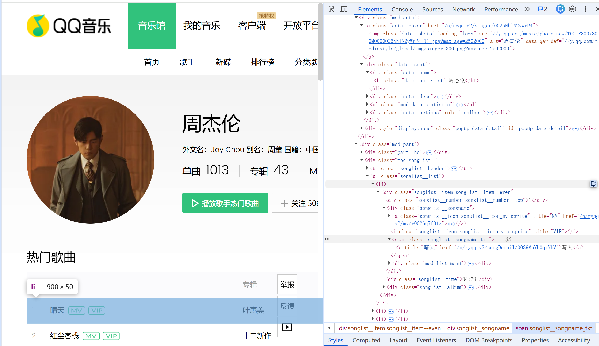
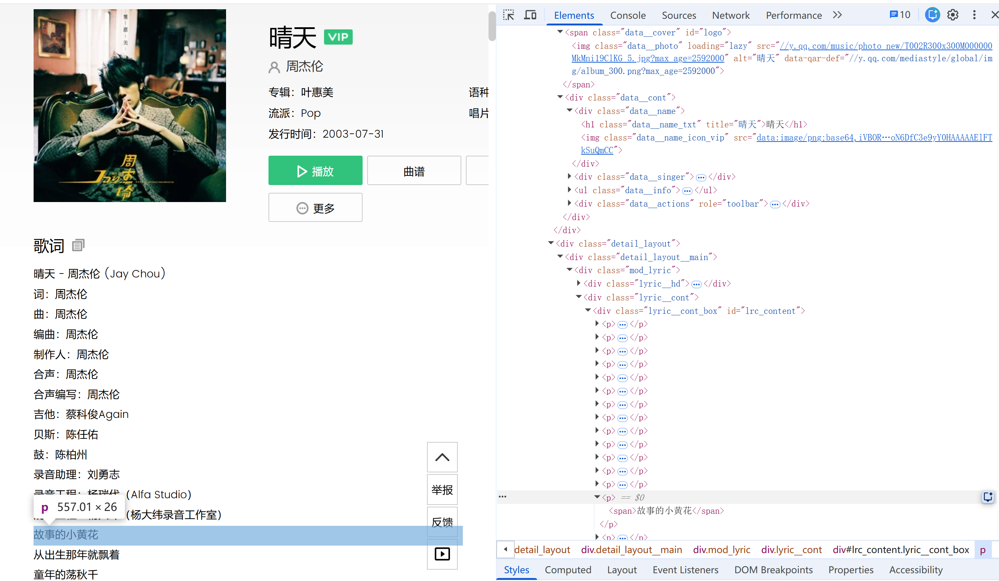
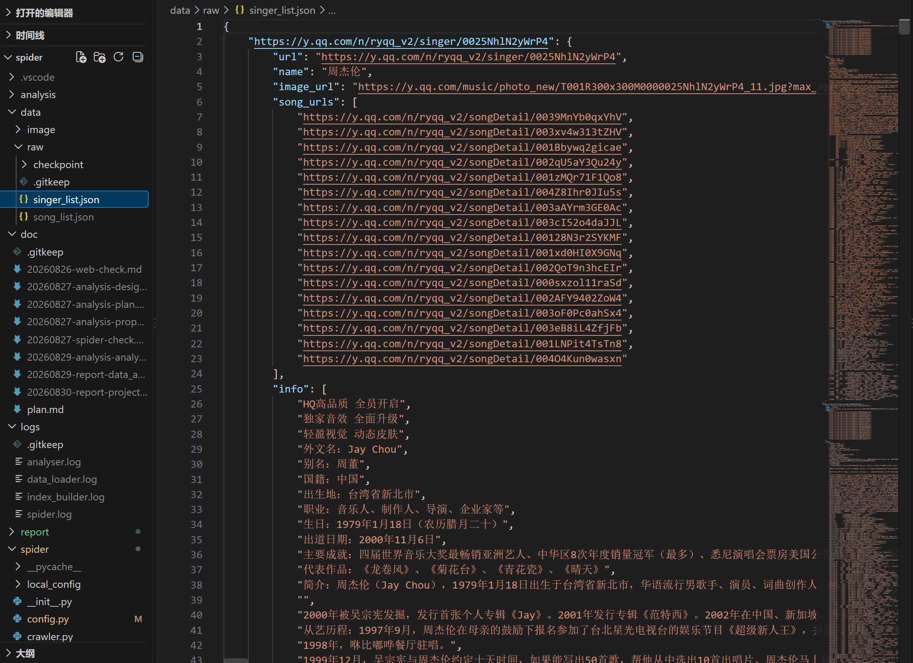
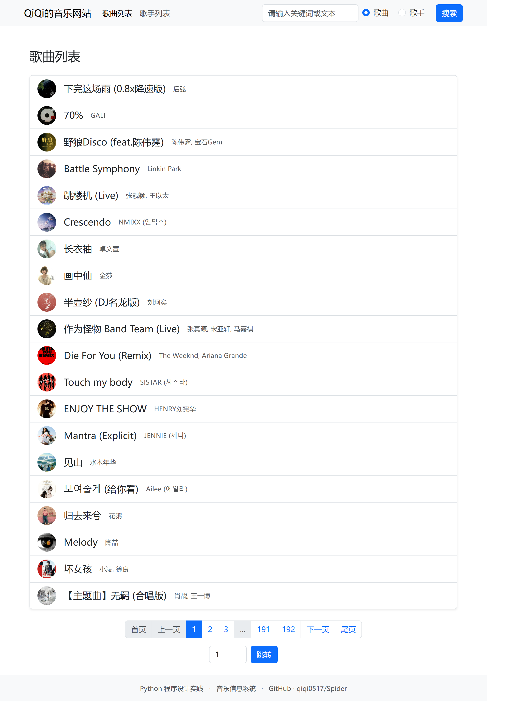
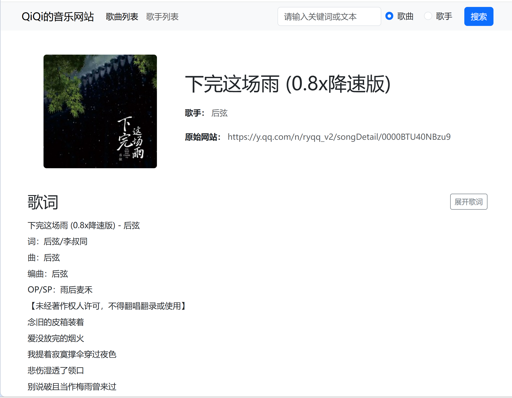
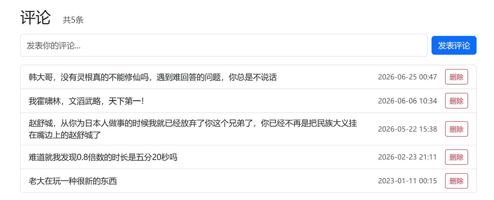
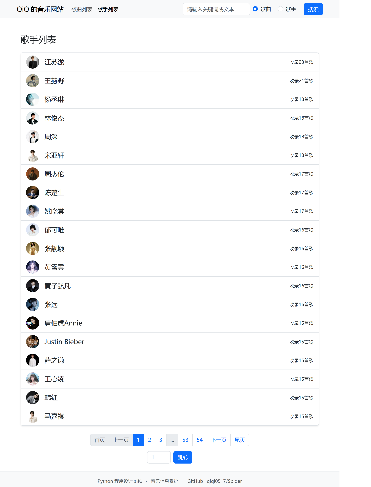
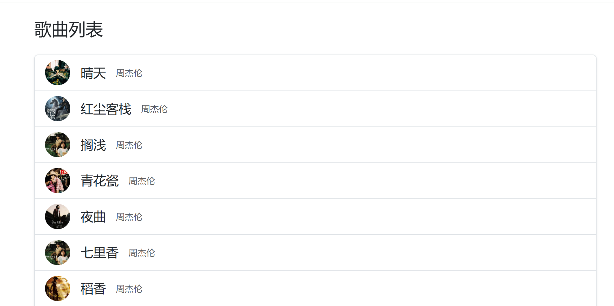
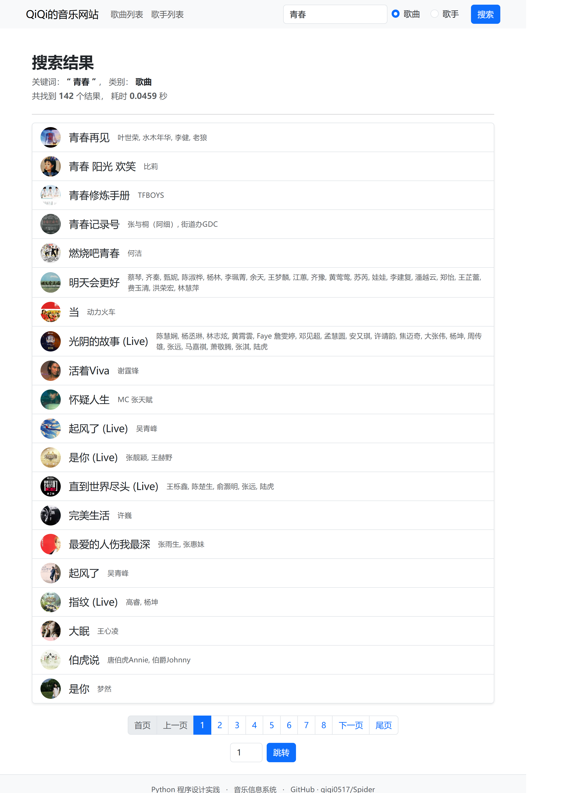

# 基于 QQ 音乐数据的爬虫、Web 展示与数据分析实验报告

> 姓名：高子淇
> 学号：2025010481 
> 班级：计54 

## 摘要

本项目围绕 QQ 音乐公开页面完成了音乐数据采集、数据持久化、Web 展示、站内搜索和数据分析。

爬虫使用 Playwright 获取动态页面，使用 Requests 下载图片，并通过检查点、原子写入、失败重试和请求间隔保证长时间采集过程可以恢复。最终原始数据包含 3835 首歌曲、1076 位歌手和 19151 条非空热门评论，同时下载了 3835 张歌曲图片和 1076 张歌手图片。

Web 部分使用 Django 和 SQLite 实现。系统提供歌曲列表、歌曲详情、歌手列表、歌手详情、评论发布与删除，以及歌曲和歌手两类搜索。搜索部分使用一元、二元倒排索引缩小候选范围，再结合规则相关度和 TF-IDF 分数排序。在当前数据规模下，实测两类搜索首次加载索引后的完整后端响应时间均小于 1 秒。

数据分析部分从评论发布时间、歌词与评论的用词、歌词语义聚类三个角度得到结论，并分别使用柱状图、词云和 t-SNE 散点图展示。项目实现了从数据采集、清洗、导入、检索、展示到分析的完整流程。


## 系统总体设计

### 数据流程

项目的数据流如下：

```text
QQ 音乐页面
    ↓ Playwright 打开动态页面并解析
歌曲、歌手、热门评论 JSON + 本地图片
    ↓ Django 管理命令清洗并导入
SQLite 数据库 + 搜索倒排索引
    ↓ Django 视图、模板与 Bootstrap
歌曲/歌手浏览、详情、评论与搜索
    ↓ Python 数据分析模块
统计表、JSON 结果与可视化图片
```

本结构将采集、Web 和分析分开：爬虫只负责形成稳定的原始数据；Web 端通过管理命令导入数据；分析模块直接读取原始数据并独立输出结果。各部分可以分别运行和检查，减少了模块之间的耦合。

### 主要目录

```text
spider/
├─ spider/                         # 爬虫代码
│  ├─ main.py                     # 爬虫入口
│  ├─ get_local_config.py         # 登录并保存本地状态
│  ├─ crawler.py                  # 页面调度、重试和图片下载
│  ├─ parser.py                   # 歌手、歌曲、歌词和评论解析
│  ├─ pipeline.py                 # JSON 与图片持久化
│  └─ config.py                   # URL、请求头、延时和路径配置
├─ data/
│  ├─ raw/                        # singer_list.json、song_list.json
│  └─ image/                      # singer/、song/
├─ web/
│  ├─ manage.py
│  ├─ music_site/                 # Django 项目配置
│  └─ music_app/                  # 模型、视图、检索、模板和管理命令
├─ analysis/                      # 三项数据分析及其输出
├─ logs/                          # 运行日志
└─ doc/                           # 设计、计划与验收文档
```

### 开发环境与技术栈

- 运行环境：`Python 3.10、Conda`
- 动态爬取：`Playwright`
- 获取图片：`Requests`，`Pillow`
- 数据保存：`json`，文件原子替换
- Web 后端：`Django 5.2.15`
- 数据库：`SQLite`
- 前端：`Django Template`，`Bootstrap 5`
- 搜索：倒排索引，规则排序，TF-IDF
- 数据分析：`Pandas`，`jieba`，`WordCloud`，`scikit-learn`，`Sentence Transformers`
- 版本管理：`Git`

## 爬虫模块的设计与实现

### 登录状态准备

QQ 音乐部分页面需要有效的浏览器状态。运行 `spider/get_local_config.py` 后，程序启动可见的 Chromium 浏览器:


用户正常完成登录后，程序会将 Cookie 和浏览器存储状态保存到仅供本机使用的配置文件。爬虫入口在启动时检查这些文件是否存在，缺少时给出明确提示。

### 数据采集过程

爬虫的主要过程如下：

1. 打开 QQ 音乐歌手列表并逐步滚动，直到达到目标数量 `singer_cnt=300`
   


2. 对歌手列表中的歌手，依次打开歌手详情页，解析歌手姓名、图片 URL、简介和“热门歌曲”列表



3. 对每个歌手“热门歌曲”列表中的歌曲，依次打开歌曲详情页，解析歌曲名、歌手、图片 URL、歌词和热门评论



4. 每首歌曲最多保存 5 条热门评论，同时记录评论正文和发布时间；
   
5. 每解析 10 个歌手和对应歌曲，将当前得到的歌手与歌曲信息写入 `data/singer_list.json` 和 `data/song_list.json`，并将检查点保存在 `data/checkpoint/`下（中断后再次运行时跳过已经完成的 URL）
   


6. 完成 QQ 音乐歌手列表中所有歌手和对应歌曲的数据爬取后，按序扫描所有歌曲。若某多歌手歌曲的某个歌手未在已保存的 `singer_list` 中，则将该歌手的信息存入 `singer_list`；若对应歌手的信息中未收录此歌曲，则将此歌曲加入歌手的 `songs` 中

7. 数据页面完成后，使用同一个 Requests Session 下载歌手图片和歌曲图片。

页面打开失败时最多重试 3 次，并指数级增加等待时间；浏览器层面也设置了有限次数的重试和最大等待时间。页面访问后会随机等待，请求间隔由配置统一控制，图片下载同样保留 1～2 秒间隔。

### 页面解析与数据清洗

`parser.py` 使用页面选择器定位所需内容，并通过 `urljoin` 统一将 `href` 拼接为 URL。歌词按行保存，评论正文会先去除两端空白；空评论不写入结果。评论时间缺少年份时补入年份。

一首歌曲可能有多位歌手，因此歌曲中的 `singer` 字段保存歌手 URL，Web 数据库中再使用多对多关系表示。通过歌曲页面发现但歌手列表中没有的歌手，也会补入歌手数据，避免出现无对应歌手记录的引用。

### 数据与图片持久化

原始数据分别保存在 `data/raw/singer_list.json` 和 `data/raw/song_list.json`。写入 JSON 时，程序先写临时文件并刷新到磁盘，再使用 `os.replace` 原子替换正式文件。这样即使程序在保存时异常退出，也不会轻易破坏上一次的完整结果。

图片下载会完成以下检查：

- 已存在且有效的图片直接跳过，避免重复下载
- 对网络错误、HTTP 429 和服务器错误进行有限次数重试
- 检查响应的 Content-Type 和内容是否为空
- 使用 Pillow 验证图片内容
  
图片同样先写入临时文件，再原子替换目标文件。

### 爬取结果与数据质量

对当前原始 JSON、图片目录及关联关系进行统计，结果如下：

| 检查项 | 实际结果 | 课程要求 | 状态 |
| --- | ---: | ---: | --- |
| 歌曲数 | 3835 | 不少于 2000 | 达到 |
| 歌手数 | 1076 | 不少于 100 | 达到 |
| 原始热门评论数 | 19151 | 可选，每首约 3 条 | 已采集且均非空 |
| 歌曲图片 | 3835 张 | 歌曲应有图片 | 与歌曲记录数一致 |
| 歌手图片 | 1076 张 | 歌手应有图片 | 与歌手记录数一致 |

## Web 系统的设计与实现

### 数据模型与数据导入

Web 系统定义了 `Singer`、`Song` 和 `Comment` 三个主要模型：

- `Singer` 保存歌手姓名、原网页 URL、本地图片、图片 URL 和简介；
- `Song` 保存歌曲名、原网页 URL、本地图片、图片 URL、歌词，并通过 `ManyToManyField` 关联歌手；
- `Comment` 保存评论正文和时间，通过 `ForeignKey` 关联歌曲。

管理命令 `import_data` 在数据库事务中读取 JSON，通过 `update_or_create` 导入歌手和歌曲，再建立歌曲与歌手的多对多关系。评论导入会跳过空文本和同一歌曲下正文、时间完全相同的重复记录，因此重复执行命令不会不断增加相同的爬取评论。

当前 SQLite 数据库包含 3835 首歌曲、1076 位歌手和 19131 条去重后的评论；没有无歌手的歌曲，也没有无歌曲的歌手。

### 歌曲列表与歌曲详情页面

网站首页为歌曲列表。每张歌曲卡片展示歌曲图片、歌曲名和歌手，点击可进入歌曲详情。分页组件包含首页、上一页、相邻数字页、下一页、尾页和输入页码跳转，能够从页面控件访问所有列表页。



歌曲详情页展示歌曲名、所有歌手、歌曲图片、歌词和 QQ 音乐原网页链接。其中：
- 歌手名可以跳转至对应的歌手详情页，原网页 URL 点击可跳转 QQ 音乐对应网页。
- 长歌词默认展示前 20 行，用户可点击 `展开歌词` 查看完整内容。展开后，按钮自动变为 `折叠歌词`，再次点击即可收起。



### 评论功能

歌曲详情页下方提供评论表单。其中：
- 评论输入框按照输入字数自适应加高
- 评论保存到 SQLite 后按时间倒序显示，最新发布的评论位于最前面
- 每条评论旁提供删除按钮
- 提交或删除后返回原歌曲详情页，并恢复评论区域的滚动位置。



### 歌手列表与歌手详情

歌手列表使用与歌曲列表一致的分页组件。列表卡片展示歌手图片、姓名和系统中收录的歌曲数，并优先展示歌曲较多的歌手。



歌手详情页展示姓名、图片、简介和 QQ 音乐原网页链接。其中：
- 点击原网页 URL 可跳转 QQ 音乐对应网页。
- 简介较长时可以展开/折叠（操作同歌曲详情页的歌词部分）

- 页面下方列出该歌手在系统中的全部歌曲，点击每首歌都可以进入该歌曲的详情页。


### 搜索与排序算法

搜索：页面顶部的搜索栏允许选择“歌曲”或“歌手”，关键词长度限制为 1～20 个字符。歌曲搜索覆盖歌曲名、歌手名和歌词；歌手搜索覆盖歌手名和简介。搜索结果页展示查询词、结果数量、后端耗时，并使用分页组件，翻页时保留关键词和搜索类型。



分类：为了在 3835 首歌曲的歌词中进行子串搜索，同时将响应时间控制在 1 秒以内，项目预先用管理命令 `build_inverted_index` 构建倒排索引，并计算TF-IDF。搜索时执行以下流程：

1. 网站启动时预加载已建好的倒排索引
2. 查询长度为 1 时使用一元索引，长度大于 1 时求二元索引候选集合的交集，记录每个候选对象对应索引的 TF-IDF 和
3. 对候选对象再次检查真实子串，保证倒排索引筛选不会产生错误结果
4. 根据名称精确匹配、前缀、名称包含、歌手字段和正文命中的优先级计算规则分数
5. 将规则分数与求和并标准化后的 TF-IDF 分数加权组合后，作为 `key` 排序


## 数据分析与可视化结果

分析模块直接读取 `data/raw/song_list.json`，三项任务均保存了中间数据和最终图片。完整的数据处理步骤、参数、32 个聚类主题等详见 [`report/data_analysis.md`](./data_analysis.md)，此处总结项目报告所需的主要结果。

### 热门评论发布时间分布

程序按小时统计 19151 条有效热门评论，并用柱状图展示 24 小时分布。20:00 至次日 00:59 共有 6649 条评论，占 34.72%；0 点有 1527 条，是评论数最多的单个小时。由此可见，本次样本的热门评论并非全天均匀分布，而是更集中在晚间休闲时段和午夜附近。


### 歌词与热门评论词云对照

程序将歌词和热门评论分别清洗、分词和计数，并同时比较原始词频与“每一万词出现次数”，避免只凭字体大小解释结果。歌词中“爱、世界、时间、回忆”等叙事和意象词更突出；评论中“喜欢、加油、故事”等评价、回应、共鸣词更常见。两类文本围绕同一批歌曲表现出“作品表达-听众反馈”的语言分工。


### 歌词语义聚类

歌词语义分析先清洗歌词，将过长歌词分成片段，用 Sentence Transformer 得到 512 维片段向量，再求平均形成歌曲向量。3789 首有效歌词被 K-Means 分成 32 个聚类，最后使用 t-SNE 将歌曲向量降到二维进行可视化。


聚类结果中可以识别出多种具有较清楚特征的主题或表达类型。例如：

| Cluster | 主题 | 典型歌曲 |
| ---: | --- | --- |
| 0 | 追梦励志 | 《篇章》《最初的梦想》《下一个天亮》 |
| 3 | 甜蜜告白 | 《Say U Love Me》《爱上你》《我是真的爱上你》 |
| 4 | 山河侠义 | 《庙堂之外》《小河淌水1952》《出山》 |
| 6 | 古风相思 | 《锦鲤抄》《半生雪》《霜雪千年》 |
| 8 | 失恋遗忘 | 《我不难过》《制裁》《我不想忘记你》 |
| 9 | 故乡旅途 | 《起风了》《乘风》《故乡》 |
| 17 | 说唱态度 | 《玩世不恭》《VLOG》《发光弹》 |
| 20 | 少年梦想 | 《快乐环岛》《梦的光点》《大梦想家》 |
| 21 | 雨夜思念 | 《屿》《下雨天》《给我一个理由忘记》 |
| 23 | 英语说唱 | 《Not Afraid》《Godzilla》《The Monster》 |
| 26 | 海洋离别 | 《珊瑚海》《大海》《大鱼》 |
| 31 | 青春成长 | 《起风了》《老男孩》《春泥》 |

相近的大类还能继续分出不同情境。例如爱情相关歌曲分别形成告白、失恋、情感拉扯、爱而不得和关系犹豫等聚类；自然意象中也形成星空、雨夜和海洋等不同聚类。这说明歌曲向量保留了一部分能够区分歌词内容和表达方式的语义特征，样本歌曲并不是均匀混合的。

聚类也存在边界：语言、重复副歌和歌词格式会影响向量。因此这些聚类适合理解为“语义和表达方式相近的一组歌曲”，不能看作唯一、严格的歌曲分类标准。
